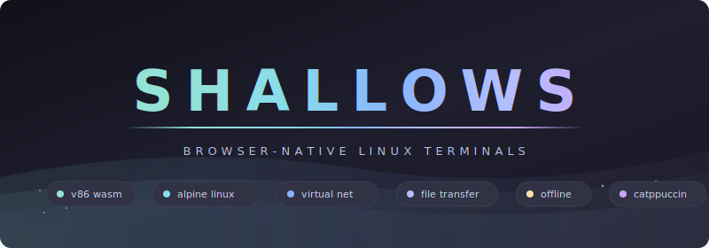

<div align="center">



Browser-native Linux terminals powered by x86 emulation. No servers, no installs, no accounts — just open and type.

> **Runs entirely in your browser. Your data never leaves your machine.**

</div>

---

## Table of Contents

- [Highlights](#highlights)
- [Quick Start](#quick-start)
- [Usage](#usage)
- [Architecture](#architecture)
- [Tech Stack](#tech-stack)
- [Features](#features)
- [Development](#development)
- [Troubleshooting](#troubleshooting)

---

## Highlights

<table>
<tr>
<td width="50%">

### Full Linux VMs
Each terminal is a complete Alpine Linux x86 virtual machine running in WebAssembly. Not a shell emulator — a real kernel, real filesystem, real processes.

</td>
<td width="50%">

### Zero Infrastructure
No Docker, no SSH, no cloud accounts. v86 boots Alpine Linux directly in your browser tab using x86 emulation compiled to WebAssembly.

</td>
</tr>
<tr>
<td>

### Inter-VM Networking
All terminals share a virtual ethernet switch. Unique MAC and IP addresses are auto-assigned — `ping`, `nc`, and TCP/UDP between VMs work out of the box.

</td>
<td>

### Instant Boot
First launch boots from ISO (~30s). After that, VM state is snapshot-cached in IndexedDB for near-instant restore on subsequent terminals.

</td>
</tr>
<tr>
<td>

### File Transfer
Drag-and-drop files into a terminal to upload. Run `sendfile <path>` inside the VM to download files back to your browser. Transfers use base64 over serial.

</td>
<td>

### Fully Offline
All assets are self-contained — BIOS, WASM engine, Alpine ISO. A service worker caches everything for offline use after the first load.

</td>
</tr>
<tr>
<td>

### Multi-Terminal Layouts
Tab view for focused work, grid view for monitoring multiple VMs. Up to 6 concurrent terminals with 128MB RAM each.

</td>
<td>

### Catppuccin Mocha
The entire UI follows the Catppuccin Mocha color palette. Dark, warm, and easy on the eyes for long sessions.

</td>
</tr>
</table>

---

## Quick Start

### GitHub Pages

Push this repo to GitHub and enable Pages (Settings > Pages > Source: GitHub Actions). The included workflow deploys automatically on push to `main`.

### Local

```sh
# Any static file server works
python3 -m http.server 8000

# Open in browser
open http://localhost:8000
```

> **Note:** If `SharedArrayBuffer` is unavailable, Shallows will still work but VMs run slower. The included service worker injects the required `COOP`/`COEP` headers automatically.

---

## Usage

**Launch a terminal**

Click **New Terminal** or use the empty state button. Alpine Linux boots to a root shell with networking pre-configured.

**Copy / Paste**

| Action | Shortcut | Button |
|--------|----------|--------|
| Copy screen text | `Ctrl+Shift+C` | Copy |
| Paste from clipboard | `Ctrl+Shift+V` | Paste |

**Upload a file (browser to VM)**

Drag and drop a file onto any terminal. The file is written to `/tmp/<filename>` inside the VM. Maximum file size is 2 MB.

**Download a file (VM to browser)**

```sh
sendfile /path/to/file
```

The file downloads through your browser automatically.

**Networking between VMs**

Each VM gets `10.0.0.<id>/24`. To test:

```sh
# In Terminal 1 (10.0.0.1)
ping 10.0.0.2

# In Terminal 2 (10.0.0.2)
nc -l -p 8080

# In Terminal 1
echo "hello" | nc 10.0.0.2 8080
```

**Switch layouts**

Click **Grid** to see all terminals at once. Click **Tabs** to return to single-terminal focus.

---

## Architecture

### Project Structure

```
index.html                              Entry point — topbar, tabs, viewport, empty state
css/style.css                           Catppuccin Mocha theme, responsive layout
js/
  libv86.js                             v86 x86 emulator (WebAssembly loader)
  v86.wasm                              v86 emulator core (WebAssembly binary)
  virtual-network.js                    VirtualSwitch + FakeWebSocket for inter-VM networking
  file-transfer.js                      Serial-based file upload/download with base64 encoding
  terminal-manager.js                   VM lifecycle, IndexedDB snapshots, auto-configuration
  ui.js                                 Tab/grid management, drag-and-drop, layout switching
  app.js                                Event wiring, clipboard, keyboard shortcuts, notifications
sw.js                                   Service worker — offline cache + COOP/COEP header injection
assets/
  bios/seabios.bin                      SeaBIOS firmware (~128 KB)
  bios/vgabios.bin                      VGA BIOS firmware (~36 KB)
  images/alpine-virt-3.20.3-x86.iso     Alpine Linux 3.20 virt x86 (~47 MB)
```

### Data Flow

```
Browser Tab
├── v86 (WASM) ── boots ──▶ Alpine Linux x86 VM
│     ├── VGA canvas ──▶ Terminal screen
│     ├── Keyboard ──▶ PS/2 input
│     ├── Serial port ──▶ File transfer (base64 markers)
│     └── Network adapter ──▶ FakeWebSocket ──▶ VirtualSwitch
│                                                    │
├── v86 (WASM) ── boots ──▶ Alpine Linux x86 VM     │
│     └── Network adapter ──▶ FakeWebSocket ─────────┘
│
├── IndexedDB ── caches ──▶ VM state snapshots
└── Service Worker ── serves ──▶ Offline assets + COOP/COEP headers
```

---

## Tech Stack

| Layer | Technology |
|-------|------------|
| Emulator | v86 0.5.319 (x86-to-WASM) |
| Guest OS | Alpine Linux 3.20 virt (x86 32-bit) |
| Networking | In-memory VirtualSwitch with FakeWebSocket |
| File Transfer | Serial port (ttyS0) with base64 marker protocol |
| State Cache | IndexedDB snapshot of full VM memory + CPU state |
| Offline | Service Worker with cache-first strategy |
| Headers | COOP/COEP injected by SW for SharedArrayBuffer |
| Theme | Catppuccin Mocha |
| Build | None — vanilla HTML/CSS/JS, no bundler |

---

## Features

| Feature | Description |
|---------|-------------|
| Alpine Linux VMs | Full x86 Alpine boot from ISO with root shell, BusyBox utilities, and APK package manager |
| Virtual Networking | Hub-style ethernet switch routes frames between VMs; auto-assigned MACs and IPs (10.0.0.0/24) |
| State Snapshots | First boot cached to IndexedDB; subsequent terminals restore in seconds instead of 30s+ cold boot |
| File Upload | Drag-and-drop sends files via serial port to `/tmp/` inside the VM |
| File Download | `sendfile` command base64-encodes and sends files back through serial to browser download |
| Clipboard | Copy screen text and paste into VM via buttons or `Ctrl+Shift+C` / `Ctrl+Shift+V` |
| Tab View | Single active terminal with tab bar for switching between instances |
| Grid View | All terminals visible simultaneously in auto-fit grid layout |
| Resource Limits | Soft warning at 4 VMs, hard limit at 6 VMs (128 MB RAM each); VM IDs are recycled from a pool to prevent unbounded growth |
| Offline Support | Service worker pre-caches small assets (HTML, CSS, JS, BIOS) immediately; large assets (libv86.js, v86.wasm, Alpine ISO) cached on first use — works without internet after first load |
| COOP/COEP | Service worker injects cross-origin isolation headers for SharedArrayBuffer performance |
| Responsive | Mobile-friendly layout, single column on small screens |

---

## Development

### Prerequisites

None. No Node.js, no bundler, no package manager. Just a static file server.

### Running Locally

```sh
python3 -m http.server 8000
```

Open `http://localhost:8000` in a modern browser (Chrome, Firefox, Edge).

### Deploying to GitHub Pages

The repo includes `.github/workflows/deploy.yml` which deploys on every push to `main`. Enable Pages in your repo settings with **Source: GitHub Actions**.

The Alpine ISO (47 MB) is committed directly. If your repo uses Git LFS, the workflow handles it automatically.

### Key Files to Know

| File | What it does |
|------|-------------|
| `js/terminal-manager.js` | VM creation, destruction, IndexedDB caching, auto-login, network config |
| `js/virtual-network.js` | `VirtualSwitch` broadcasts ethernet frames; `FakeWebSocket` implements the WebSocket API |
| `js/file-transfer.js` | Upload via `serial0_send()`, download by listening on `serial0-output-byte` |
| `js/ui.js` | Tab/grid layout, drag-and-drop zones, empty state management |
| `js/app.js` | Clipboard wiring, keyboard shortcuts, compatibility checks, service worker registration |
| `sw.js` | Offline caching, COOP/COEP header injection for SharedArrayBuffer |

---

## Troubleshooting

| Problem | Solution |
|---------|----------|
| VM won't boot | Check browser console for WASM errors. Ensure `js/v86.wasm` and `assets/` files are accessible |
| "WebAssembly not supported" | Your browser or network policy blocks WASM. Try a different browser or disable restrictive extensions |
| Slow VM performance | SharedArrayBuffer may be unavailable. The service worker injects COOP/COEP headers — ensure `sw.js` registered successfully |
| Terminals can't ping each other | VMs cloned from snapshot share MACs. Shallows assigns unique MACs automatically — ensure auto-config completed (check for `ip link set` in console) |
| File upload not working | Drag-and-drop requires the VM to be fully booted. Wait for the loading overlay to disappear |
| `sendfile` command not found | The command is installed during auto-login. If you interrupted boot config, run: `cat > /usr/local/bin/sendfile << 'EOF'` and paste the script manually |
| Clipboard buttons don't work | Browser requires HTTPS or localhost for clipboard API access. Use `python3 -m http.server` locally |
| Page shows scrollbar | The UI is designed for `100vh` with `overflow: hidden`. If you see a scrollbar, check for browser extensions injecting content |

---

<div align="center">

**Real Linux. Real networking. Zero servers.**

</div>
